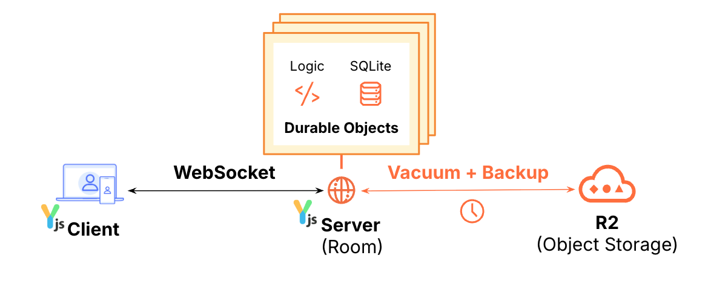
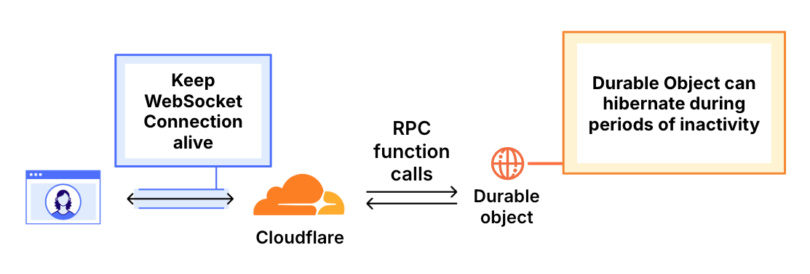

# Yjs WebSocket Provider

[](https://deploy.workers.cloudflare.com/?url=https://github.com/TimoWilhelm/yjs-cf-ws-provider)

This is a Yjs WebSocket Connector that uses Cloudflare Workers + Durable Objects to relay messages between clients.  It is compatible with the [Yjs WebSocket Connector](https://github.com/yjs/y-websocket).



This project uses the Cloudflare Durable Objects WebSocket Hibernation API to terminate WebSocket connections to avoid incurring duration charges when the connection is idle.



It also periodically saves the Yjs document state to a Cloudflare R2 storage bucket and clears the partial updates from the Durable Object storage. The vacuum interval can be configured with the YJS_VACUUM_INTERVAL_IN_MS environment variable. The default is 30 seconds.

## Run locally

```bash
npm install
npm run dev
```

This will start a local server using the Wrangler CLI and serve a demo app. You can open a browser
to the URL that is displayed in the console to test it with a simple [TipTap](https://tiptap.dev/)
editor.
